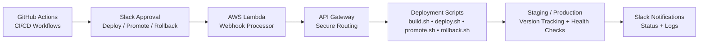

<!-- Animated Header (Light + Dark Auto Mode) -->

  <picture>
    <source media="(prefers-color-scheme: dark)" srcset="https://readme-typing-svg.herokuapp.com?size=28&color=00AEEF&center=true&vCenter=true&width=700&lines=Franklin+%7C+DevOps+%26+SRE+Engineer;AWS+%7C+CI%2FCD+%7C+Automation+%7C+Observability;Building+Reliable+Scalable+Systems">
    
  </picture>

  

# 👋 Hi, I'm Franklin  
**DevOps & Site Reliability Engineer | AWS | CI/CD | Automation | Observability**

I design reliable, scalable and fully automated systems using AWS, Docker, GitHub Actions, Linux and modern SRE tooling.
I specialize in infrastructure architecture, operational automation and the engineering patterns that keep platforms stable at scale**.

---

## 👀 Visitor Counter

---

# 🧱 Tech Stack Wall 

**☁️ Cloud:**  

**⚙️ CI/CD:**  

**🤖 Automation:**  

**🐳 Containers:**  

**📈 Observability:**  

**🧩 Backend:**  

**🛠 DevOps Practices:**  

---

# 🏆 Top DevOps Projects (Quick Grid)

| Project | Stack | Highlights |
|--------|--------|------------|
| **DevOps Automation** | GitHub Actions • Lambda • API Gateway | Slack-driven deploy, promote, rollback |
| **SRE Platform** | Prometheus • Grafana • Alertmanager | Metrics, dashboards, alerts |
| **Finance API** | FastAPI • Terraform • ECS Fargate | Cloud-native backend |
| **Ansible Suite** | Ansible • Linux | 15+ automation playbooks |
| **Java CI/CD** | Jenkins • Maven • SonarQube • Nexus | Full pipeline on EC2 |

---

# 🔧 CI/CD Flow

# 📌 Featured Projects

---

## **DevOps & SRE Engineering**

<strong>🚀 DevOps Deployment Automation — Slack‑Driven CI/CD • GitHub Actions • AWS Lambda • Rollback System</strong>

**Repo:**  
• [DevOps Deployment Automation](https://github.com/Franklindot04/devops-deployment-automation)

**Workflow Badges:**  

**Tech Badges:**  

**Description:**  
A fully automated, Slack‑controlled CI/CD pipeline built with GitHub Actions, AWS Lambda, API Gateway and a complete stateless rollback system.  
This project demonstrates real‑world DevOps/SRE practices: multi‑environment deployments, version tracking, health checks, promotion workflows and automated rollback triggered from Slack.

---

### **Key Capabilities**
- Slack‑driven deployments (deploy, promote, rollback)
- Multi‑environment CI/CD (staging + production)
- Stateless version tracking using version files
- Automated health checks before marking deploy successful
- Zero‑downtime rollback to previous stable version
- Dockerized application for consistent builds
- AWS Lambda + API Gateway for Slack webhook handling

---

### **Scripts Included (Production‑Style Automation)**
Located in `scripts/`:

- `build.sh` — Build Docker image  
- `push.sh` / `push_staging.sh` — Push image to ECR  
- `deploy_staging.sh` — Deploy to staging  
- `deploy_production.sh` — Deploy to production  
- `promote.sh` — Promote staging → production  
- `rollback_production.sh` — Roll back to previous version  
- `healthcheck.sh` — Validate service health  
- `logs.sh` — Fetch logs for debugging  

---

### **Architecture Overview**
GitHub Actions → AWS Lambda → API Gateway → Deployment Scripts → Version Tracking → Slack Notifications

---

### **What This Demonstrates**
- Multi‑stage CI/CD pipeline design  
- Slack‑driven operational workflows  
- Stateless deployment + rollback strategy  
- Automated health checks & promotion logic  
- GitHub Actions + AWS Lambda integration  
- Production‑style deployment scripting  
- Real SRE operational maturity  

---

<strong>📊 Prometheus + Grafana SRE Observability Platform</strong>

**Repo:**  
• [Prometheus + Grafana SRE Platform](https://github.com/Franklindot04/prometheus-grafana-sre-project-Franklin)

**Shields:**  

**Description:**  
A full production‑grade observability and alerting platform built around a FastAPI application instrumented with Prometheus metrics, visualized through Grafana dashboards, monitored externally via Blackbox Exporter and equipped with a complete alerting pipeline using Prometheus alert rules + Alertmanager + Grafana‑managed alerts.

**Key Capabilities:**  
- Custom FastAPI metrics (request count, latency histograms, Python internals)  
- Blackbox Exporter for external uptime monitoring  
- Auto‑provisioned Grafana dashboards (FastAPI, Blackbox, Prometheus internals)  
- Full alerting pipeline (Prometheus → Alertmanager → Slack)  
- Grafana‑managed alert rules for external probe failures  
- Environment‑aware configuration (macOS vs Linux exporters)  
- Secure secret management using `.env` + Alertmanager variable injection  
- Modular, production‑ready Docker Compose architecture  

**Alerting Features:**  
- Critical & warning alerts (latency, traffic spikes, target down, app down)  
- Blackbox probe alerts for external endpoint failures  
- Slack notifications with runbook links, severity labels & metadata  
- Automatic alert resolution when services recover  

**Architecture Overview:**  
FastAPI → Prometheus → Grafana → Alertmanager → Slack  
Blackbox Exporter → Prometheus → Grafana → Alerts  

**What This Demonstrates:**  
Real SRE practices: instrumentation, exporters, alerting, dashboards, runbooks, secret management and operational readiness.

---

<strong>🛠 Ansible Automation Suite — 15+ Production‑Style Playbooks</strong>

**Repo:**  
• [Ansible Work 1](https://github.com/Franklindot04/ansible-work-1)

**Shields:**  

**Description:**  
A comprehensive collection of 15+ Ansible playbooks designed to automate real‑world Linux server operations, application deployments, configuration management and environment provisioning.  
This suite demonstrates production‑style automation patterns including multi‑play orchestration, templating, handlers, dynamic variables and reusable role‑based structures.

**Key Capabilities:**  
- Server provisioning & configuration (users, packages, services)  
- Web application deployments (HTML, PHP, Angular)  
- Apache/HTTPD setup & environment configuration  
- Maintenance mode workflows (blue/green‑style switch)  
- Dynamic Jinja2 templating & variable injection  
- Logical conditions, handlers & multi‑play orchestration  
- Role‑ready structure for scalable automation  

**Included Playbooks:**  
- Server setup & package installation  
- Apache/HTTPD provisioning  
- E‑commerce & food‑delivery sample deployments  
- HTML, PHP & Angular app deployments  
- Maintenance mode automation  
- Static & dynamic variable examples  
- Ubuntu server configuration  
- Multi‑package & logical condition automation  

**What This Demonstrates:**  
- Infrastructure automation fundamentals  
- Idempotent configuration management  
- Reusable automation patterns  
- Real DevOps workflows using Ansible at scale  

---

## **Backend & Microservices**

<strong>🧠 Face Recognition Platform (Private Repo)</strong>

**Description:**  
InsightFace + FastAPI + Docker + AWS.  
Embedding generation, vector search, user enrollment, secure APIs.

---

<strong>⚙ Python Background Job Microservice — FastAPI • Redis • RQ • Docker Compose</strong>

**Repo:**  
• [Python Background Job Microservice](https://github.com/Franklindot04/python-background-job-microservice)

**Shields:**  

**Description:**  
A production‑style microservice architecture built with FastAPI, Redis and RQ for asynchronous background job processing.  
The system exposes an HTTP API for submitting jobs, checking job status and retrieving results — while a dedicated worker processes tasks asynchronously.  
All components run in isolated containers using Docker Compose.

**Key Capabilities:**  
- FastAPI HTTP API for job submission & status tracking  
- Redis as a message broker / job queue  
- RQ worker for asynchronous background processing  
- Fully containerized with Docker & Docker Compose  
- Logs, troubleshooting, and multi‑service orchestration  
- Deployable on AWS EC2 or any Linux host  

**Architecture:**  
API → Redis → Worker  
Jobs are queued by the API, processed by the worker, and results retrieved via HTTP.

**Why This Matters:**  
Demonstrates real DevOps microservice patterns:  
- Service separation  
- Asynchronous processing  
- Container orchestration  
- Logging & troubleshooting  
- Environment‑ready structure  

**Tech Stack:**  
FastAPI • Redis • RQ • Docker • Docker Compose • Linux

---

<strong>💰 Finance Tracker API — FastAPI • Docker • Terraform • AWS ECS Fargate</strong>

**Repo:**  
• [Finance Tracker API](https://github.com/Franklindot04/finance-tracker-api)

**Shields:**  

**Description:**  
A production‑ready FastAPI backend for tracking personal expenses — fully containerized with Docker and deployed to AWS ECS Fargate using Terraform.  
This project demonstrates real‑world DevOps engineering: Infrastructure as Code, secure VPC networking, load‑balanced container workloads, RDS PostgreSQL and cloud‑native observability.

**Key Capabilities:**  
- JWT‑based authentication (register/login)  
- CRUD operations for expenses  
- SQLite locally, PostgreSQL (RDS) in production  
- Modular FastAPI architecture (routers, models, schemas, core)  
- Dockerfile + docker‑compose for local development  
- Swagger UI at `/docs`  
- CI/CD‑ready structure for GitHub Actions → ECS  

**Cloud Infrastructure (Terraform):**  
- VPC with public + private subnets  
- Application Load Balancer (public)  
- ECS Fargate service (private subnets)  
- RDS PostgreSQL (private subnets)  
- Security groups with least‑privilege access  
- IAM roles for ECS task execution & logging  
- CloudWatch log groups for observability  
- ECR repository for container images  

**High‑Level Architecture:**  
ALB → ECS Fargate Task → RDS PostgreSQL  
VPC with NAT Gateway, route tables, and VPC endpoints for ECR/S3.

**Authentication Flow:**  
- Register → Login → Receive JWT → Use token in Authorization header  
- Fully stateless, token‑based authentication  

**What This Demonstrates:**  
- Cloud‑native application deployment  
- Infrastructure as Code with Terraform  
- Secure networking and IAM design  
- Container orchestration with ECS Fargate  
- Production‑grade backend engineering  

---

<strong>🎮 Number Guess Game — Full CI/CD Pipeline (Jenkins • Maven • SonarQube • Nexus • Tomcat)</strong>

**Repo:**  
• [Number Guess Game](https://github.com/Franklindot04/number_guess_game/tree/master)

**Shields:**  

**Description:**  
A fully automated CI/CD pipeline for a Java Servlet web application deployed on AWS EC2.  
This project demonstrates a complete DevOps workflow: build, test, quality gate checks, artifact versioning and automated deployment to Tomcat — all orchestrated through Jenkins Pipeline‑as‑Code.

**Key Capabilities:**  
- Maven build + unit tests on every commit  
- SonarQube Quality Gates for static analysis  
- Versioned `.war` artifacts stored in Nexus  
- Automated deployment to Apache Tomcat  
- Zero manual steps — fully automated CI/CD  
- Clean, production‑style multi‑server architecture on AWS  

**Infrastructure:**  
- Jenkins (CI engine)  
- SonarQube (code quality)  
- Nexus Repository Manager (artifact storage)  
- Apache Tomcat (deployment target)  
- AWS EC2 instances (isolated services, no config drift)  

**Versioning & Rollback:**  
- Every build stored in Nexus with unique version  
- Any version can be redeployed via Jenkins  
- Safe, controlled rollback workflow  

**UI Enhancements:**  
- Centered layout  
- Modern block‑style container  
- Mossy‑hollow color theme  
- Improved user feedback  

**Tech Stack:**  
Java Servlets + JSP • Maven • Jenkins Pipeline • SonarQube • Nexus • Tomcat • AWS EC2

---

🧩 What I’m Building Now

Developing a Face Recognition Platform using InsightFace with a microservice architecture (backend + model-service)  
Expanding my DevOps automation framework (Slack-driven deploy/promotion/rollback)  
Building a full SRE observability ecosystem (metrics, alerts, dashboards, runbooks)  
Designing cloud-native backend systems with Terraform + ECS Fargate
 
---

📊 GitHub Stats & Activity

---

👨‍💻 About Me  
I'm Franklin, a DevOps & SRE engineer passionate about automation, cloud infrastructure, observability and building production-ready systems.

⭐ Support  
If you find my work useful, consider giving a ⭐  it helps others discover it.
