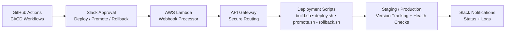

<!-- Animated Header (Light + Dark Auto Mode) -->

  <picture>
    <source media="(prefers-color-scheme: dark)" srcset="https://readme-typing-svg.herokuapp.com?size=28&color=00AEEF&center=true&vCenter=true&width=700&lines=Franklin+%7C+DevOps+%26+SRE+Engineer;AWS+%7C+CI%2FCD+%7C+Automation+%7C+Observability;Building+Reliable+Scalable+Systems">
    
  </picture>

  

# 👋 Hi, I'm Franklin

**DevOps & Site Reliability Engineer | AWS | CI/CD | Automation | Observability**

I design reliable, scalable and fully automated systems using AWS, Docker, GitHub Actions, Linux, and modern SRE tooling.
I specialize in infrastructure architecture, operational automation, and the engineering patterns that keep platforms stable at scale.

---

## 🎯 Engineering Focus

* Building production-style DevOps, SRE and platform engineering systems
* Designing CI/CD workflows with rollback, promotion and approval patterns
* Implementing observability with metrics, logs, dashboards, alerts and runbooks
* Creating Kubernetes-based platforms, GitOps workflows and self-service developer tooling
* Automating infrastructure and operational workflows using AWS, Terraform, Ansible and Python
* Building production-style backend systems with FastAPI, authentication, databases, testing and containerization

---

## 👀 Visitor Counter

---

## 🧠 Core Strengths

---

# 🧱 Tech Stack Wall

**☁️ Cloud:**        

**⚙️ CI/CD:**   

**🤖 Automation:**   

**🐳 Containers:**   

**📈 Observability:**    

**🧩 Backend:**      

**🛠 DevOps Practices:**     

---

# 🏆 Top DevOps Projects (Quick Grid)

| Project                 | Stack                                                 | Highlights                             |
| ----------------------- | ----------------------------------------------------- | -------------------------------------- |
| **DevOps Automation**   | GitHub Actions • Lambda • API Gateway                 | Slack-driven deploy, promote, rollback |
| **SRE Platform**        | Prometheus • Grafana • Alertmanager                   | Metrics, dashboards, alerts            |
| **Travel SRE AI Agent** | Kubernetes • TypeScript • Prometheus • Grafana • Loki | Self-healing microservice platform     |
| **Kubernetes IDP**      | Kubernetes • GitOps • Helm • Service Templates        | Internal developer platform            |
| **Ecommerce API**       | FastAPI • SQLAlchemy • Alembic • Redis • Docker       | Production-style backend               |
| **Finance API**         | FastAPI • Terraform • ECS Fargate                     | Cloud-native backend                   |
| **Ansible Suite**       | Ansible • Linux                                       | 15+ automation playbooks               |
| **Java CI/CD**          | Jenkins • Maven • SonarQube • Nexus                   | Full pipeline on EC2                   |

---

# 🔧 CI/CD Flow

# 📌 Featured Projects

---

## **DevOps & SRE Engineering**

<strong>🧠 Travel SRE AI Agent Platform — Kubernetes • Observability • SLOs • Auto-Remediation</strong>

**Repo:**
• [Travel SRE AI Agent Platform](https://github.com/Franklindot04/travel-sre-ai-agent-platform)

**Shields:**      

**Description:**
A Kubernetes-native, production-style SRE platform built around a travel booking microservice ecosystem.
The platform includes an API gateway, booking service, inventory service, payment service, search service, UI portal, and an AI SRE Agent that analyzes incidents, receives Alertmanager webhooks and performs controlled remediation actions.

**Key Capabilities:**

* Multi-service Kubernetes architecture with TypeScript services
* GitOps-ready Kubernetes manifests
* Prometheus metrics and ServiceMonitor integration
* Grafana dashboards for platform and service visibility
* Loki + Promtail centralized logging
* SLOs, error budgets and burn-rate alerts
* Slack alerting through Alertmanager
* Auto-remediation workflows: restart, scale and escalate
* UI portal for service health, deployment version and incident visibility

**Architecture Overview:**
Client / UI Portal → API Gateway → Search / Booking / Inventory / Payment Services
Services → Prometheus + Loki → Alertmanager → Slack + AI SRE Agent → Kubernetes API

**What This Demonstrates:**

* Kubernetes platform engineering
* Modern SRE practices using SLOs and burn-rate alerts
* Production-style observability architecture
* Incident analysis and self-healing workflows
* GitOps-ready platform delivery
* Reliability engineering applied to a real microservice domain

---

<strong>🚀 DevOps Deployment Automation — Slack-Driven CI/CD • GitHub Actions • AWS Lambda • Rollback System</strong>

**Repo:**
• [DevOps Deployment Automation](https://github.com/Franklindot04/devops-deployment-automation)

**Workflow Badges:**

**Tech Badges:**        

**Description:**
A fully automated, Slack-controlled CI/CD pipeline built with GitHub Actions, AWS Lambda, API Gateway and a complete stateless rollback system.
This project demonstrates real-world DevOps/SRE practices: multi-environment deployments, version tracking, health checks, promotion workflows, and automated rollback triggered from Slack.

**Key Capabilities:**

* Slack-driven deployments (deploy, promote, rollback)
* Multi-environment CI/CD (staging + production)
* Stateless version tracking using version files
* Automated health checks before marking deploy successful
* Zero-downtime rollback to previous stable version
* Dockerized application for consistent builds
* AWS Lambda + API Gateway for Slack webhook handling

**Scripts Included:**

* `build.sh` — Build Docker image
* `push.sh` / `push_staging.sh` — Push image to ECR
* `deploy_staging.sh` — Deploy to staging
* `deploy_production.sh` — Deploy to production
* `promote.sh` — Promote staging → production
* `rollback_production.sh` — Roll back to previous version
* `healthcheck.sh` — Validate service health
* `logs.sh` — Fetch logs for debugging

**Architecture Overview:**
GitHub Actions → AWS Lambda → API Gateway → Deployment Scripts → Version Tracking → Slack Notifications

**What This Demonstrates:**

* Multi-stage CI/CD pipeline design
* Slack-driven operational workflows
* Stateless deployment and rollback strategy
* Automated health checks and promotion logic
* GitHub Actions + AWS Lambda integration
* Production-style deployment scripting
* Real SRE operational maturity

---

<strong>📊 Prometheus + Grafana SRE Observability Platform</strong>

**Repo:**
• [Prometheus + Grafana SRE Platform](https://github.com/Franklindot04/prometheus-grafana-sre-project-Franklin)

**Shields:**     

**Description:**
A production-grade observability and alerting platform built around a FastAPI application instrumented with Prometheus metrics, visualized through Grafana dashboards, monitored externally via Blackbox Exporter, and equipped with a complete alerting pipeline using Prometheus alert rules, Alertmanager and Grafana-managed alerts.

**Key Capabilities:**

* Custom FastAPI metrics
* Request count and latency histograms
* Python runtime metrics
* Blackbox Exporter for external uptime monitoring
* Auto-provisioned Grafana dashboards
* Prometheus → Alertmanager → Slack alerting
* Grafana-managed alert rules
* Environment-aware exporter configuration
* Secure secret management using `.env`
* Modular Docker Compose architecture

**What This Demonstrates:**
Real SRE practices including instrumentation, exporters, alerting, dashboards, runbooks, secret management and operational readiness.

---

<strong>🛠 Ansible Automation Suite — 15+ Production-Style Playbooks</strong>

**Repo:**
• [Ansible Work 1](https://github.com/Franklindot04/ansible-work-1)

**Shields:**   

**Description:**
A comprehensive collection of 15+ Ansible playbooks designed to automate real-world Linux server operations, application deployments, configuration management and environment provisioning.

**Key Capabilities:**

* Server provisioning and configuration
* Web application deployments
* Apache/HTTPD setup and environment configuration
* Maintenance mode workflows
* Dynamic Jinja2 templating
* Handlers and multi-play orchestration
* Role-ready automation structures

**What This Demonstrates:**

* Infrastructure automation fundamentals
* Idempotent configuration management
* Reusable automation patterns
* Real DevOps workflows using Ansible

---

## **Backend & Microservices**

<strong>🛒 Ecommerce Microservice API — FastAPI • Redis • Alembic • Docker • Production Readiness</strong>

**Repo:**
• [Ecommerce Microservice API](https://github.com/Franklindot04/ecommerce-api)

**Shields:**      

**Description:**
A learning-oriented ecommerce microservice developed incrementally through 15 milestone-based stages, evolving from a simple FastAPI MVP into a realistic production-style backend.

The project covers the full backend development lifecycle: API design, multi-user authentication, service-layer architecture, database migrations, Redis caching and rate limiting, background tasks, mock payment workflows, automated testing, Docker, centralized configuration and production-readiness hardening.

**Key Capabilities:**

* Product, cart and order APIs
* User registration and JWT authentication
* User-owned carts and orders
* Order lifecycle and state transition validation
* Mock payment workflow with database persistence
* Alembic-managed schema migrations
* Redis-backed product caching
* Redis-backed login rate limiting
* Background invoice and notification generation
* Pytest test suite with isolated SQLite and FakeRedis fixtures
* Centralized environment-driven configuration using `pydantic-settings`
* FastAPI lifespan-based startup initialization
* Standardized HTTP and validation error responses
* Docker Compose Redis healthcheck dependency
* Environment-safe `.env.example` configuration template

**Project Status:**
All 15 implementation stages are complete.

**What This Demonstrates:**

* Production-style backend engineering
* API and service-layer architecture
* Authentication and multi-user data ownership
* Database schema evolution with Alembic
* Caching and rate limiting with Redis
* Automated testing and test isolation
* Containerized application development
* Configuration and deployment readiness

---

<strong>🧠 Face Recognition Platform (Private Repo)</strong>

**Description:**
InsightFace + FastAPI + Docker + AWS.
Embedding generation, vector search, user enrollment and secure APIs.

---

<strong>⚙ Python Background Job Microservice — FastAPI • Redis • RQ • Docker Compose</strong>

**Description:**
A Python microservice focused on background job processing using FastAPI, Redis and RQ.

The project explores asynchronous job workflows, queue-backed processing and containerized local development.

**What This Demonstrates:**

* Background job processing
* Redis-backed queues
* FastAPI service design
* Docker Compose workflows

---

## **Java & CI/CD Engineering**

<strong>🎮 Number Guess Game — Full CI/CD Pipeline (Jenkins • Maven • SonarQube • Nexus • Tomcat)</strong>

**Repo:**
• [Number Guess Game](https://github.com/Franklindot04/number_guess_game/tree/master)

**Shields:**       

**Description:**
A fully automated CI/CD pipeline for a Java Servlet web application deployed on AWS EC2.

The project demonstrates a complete DevOps workflow: build, test, quality gate checks, artifact versioning and automated deployment to Tomcat, all orchestrated through Jenkins Pipeline-as-Code.

**Key Capabilities:**

* Maven build and unit tests on every commit
* SonarQube Quality Gates
* Versioned `.war` artifacts stored in Nexus
* Automated deployment to Apache Tomcat
* Fully automated CI/CD workflow
* Production-style multi-server architecture on AWS

**Versioning & Rollback:**

* Every build stored in Nexus with a unique version
* Any version can be redeployed through Jenkins
* Safe, controlled rollback workflow

**Tech Stack:**
Java Servlets + JSP • Maven • Jenkins Pipeline • SonarQube • Nexus • Tomcat • AWS EC2

---

## 🧩 What I'm Building Now

* Building a **Face Recognition Platform** *(private repository)* using InsightFace with a microservice architecture (backend + model service)
* Expanding a **DevOps Automation Framework** featuring Slack-driven deployments, promotion workflows and automated rollbacks
* Building a **Platform Engineering Maturity Lab** *(private repository)* focused on engineering governance, CI/CD, operational readiness, security and platform best practices
* Developing a **Kubernetes Internal Developer Platform (IDP)** with GitOps, Helm, self-service developer tooling and standardized deployment workflows
* Growing a **Java Mastery Repository** covering Java fundamentals through advanced backend engineering, Spring Boot, Kubernetes, Helm, Infrastructure as Code, cloud architecture and distributed systems
* Designing cloud-native infrastructure using **AWS, Terraform, Docker, Kubernetes and ECS Fargate**
* Expanding a production-style **SRE observability ecosystem** with metrics, dashboards, alerts, logging and operational runbooks

---

📊 GitHub Stats & Activity

---

## 👨‍💻 About Me

I'm Franklin, a DevOps and Site Reliability Engineer with a focus on automation, cloud infrastructure, observability, platform engineering and building reliable, production-ready systems.

## ⭐ Support

If you find any of these projects useful, consider giving them a ⭐. Your support helps others discover them.
